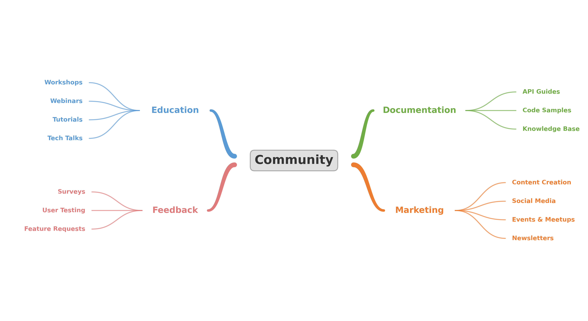
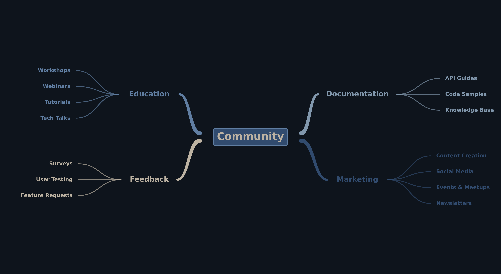
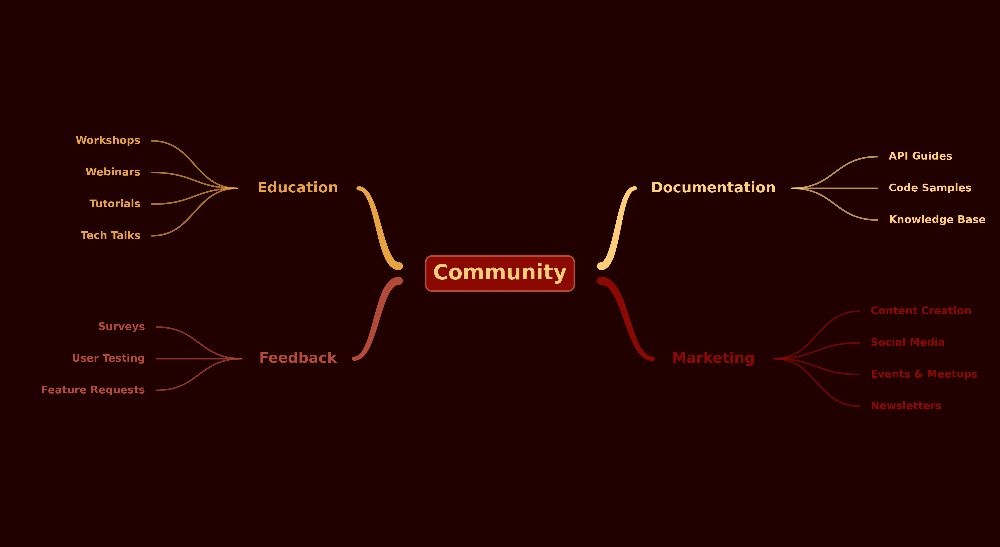
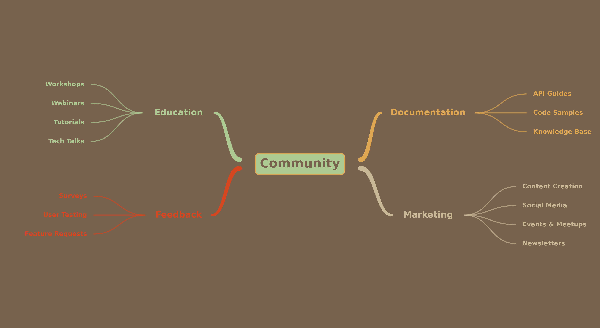
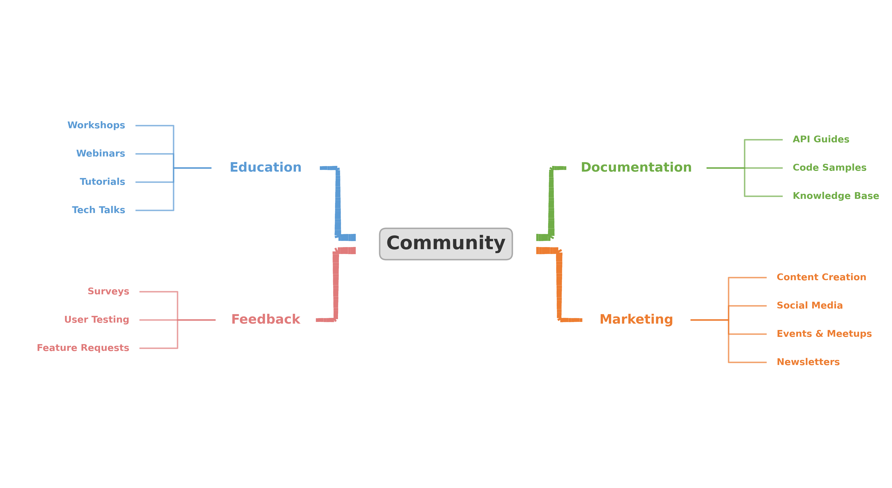
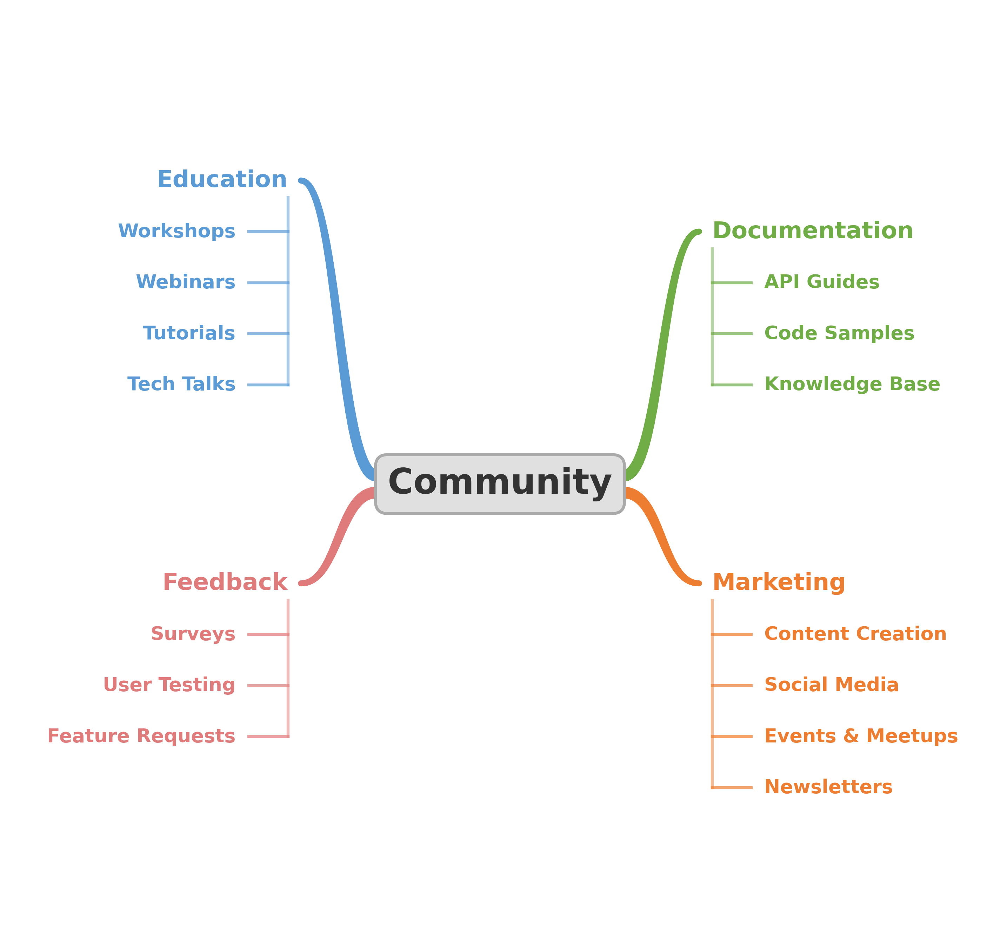

# Mindmap Builder

A Python-based mindmap generator that produces SVG and PNG outputs with clickable hyperlinks, multiple color themes, line styles, and layout options.



## Features

- **Dictionary-driven** -- define your mindmap content in a simple Python dict
- **Clickable SVG hyperlinks** -- each node can link to a URL (opens in new tab)
- **4 color themes** -- Classic, Midnight, Ember, Safari
- **2 line styles** -- Organic (bezier curves) and Angular (90-degree lines)
- **2 layouts** -- Horizontal (wide) and Vertical (narrow/portrait)
- **React viewer** -- browser-based switcher for all theme/style/layout combos

## Themes

### Midnight


### Ember


### Safari


## Styles

### Angular


## Layouts

### Vertical


## Quick Start

```bash
pip install matplotlib
python mm.py
```

This generates all combinations of theme/style/layout as SVG and PNG files.

## Usage

```python
from mm import draw_mindmap, MINDMAP

# Default: classic theme, organic style, horizontal layout
draw_mindmap(MINDMAP, "output.svg")

# Customize
draw_mindmap(MINDMAP, "dark.svg", theme="midnight", style="angular", layout="vertical")
```

### Parameters

| Parameter | Options | Default |
|-----------|---------|---------|
| `theme` | `classic`, `midnight`, `ember`, `safari` | `classic` |
| `style` | `organic`, `angular` | `organic` |
| `layout` | `horizontal`, `vertical` | `horizontal` |

## Configuration

Edit the `MINDMAP` dict in `mm.py` to define your own content:

```python
MINDMAP = {
  "center": {
    "label": "My Topic",
    "url": "https://example.com",
  },
  "groups": [
    {
      "title": "Category",
      "url": "https://example.com/category",
      "position": (-0.90, 0.35),
      "side": "left",
      "half_width": 0.22,
      "items": [
        ("Item 1", "https://example.com/item1"),
        ("Item 2", "https://example.com/item2"),
      ],
    },
    # ... more groups
  ],
}
```

## Custom Themes

Add a theme to the `THEMES` dict:

```python
THEMES["mytheme"] = {
  "background":    "#FFFFFF",
  "center_bg":     "#E0E0E0",
  "center_border": "#AAAAAA",
  "center_text":   "#333333",
  "branches": ["#5B9BD5", "#70AD47", "#E07B7B", "#ED7D31"],
}
```

## React Viewer

Open `index.html` in a browser (via a local server) to interactively switch between all theme/style/layout combinations:

```bash
python -m http.server 8765
# Open http://localhost:8765
```

## Requirements

- Python 3.7+
- matplotlib
