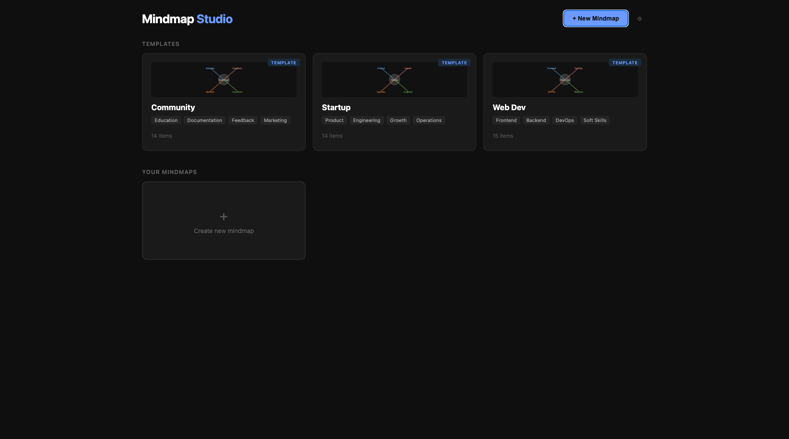
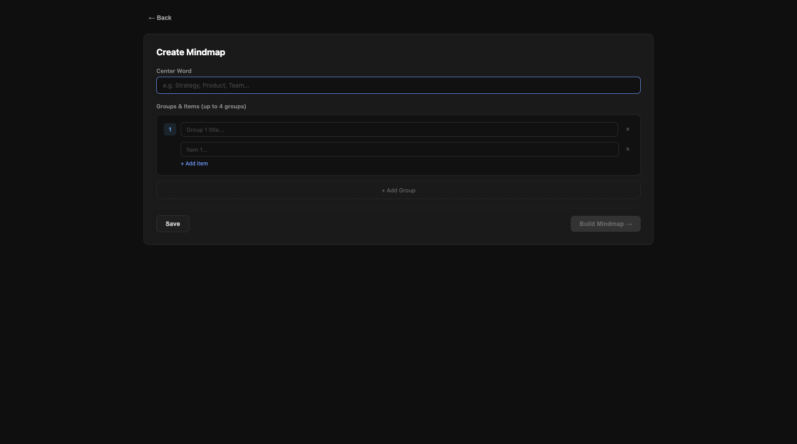
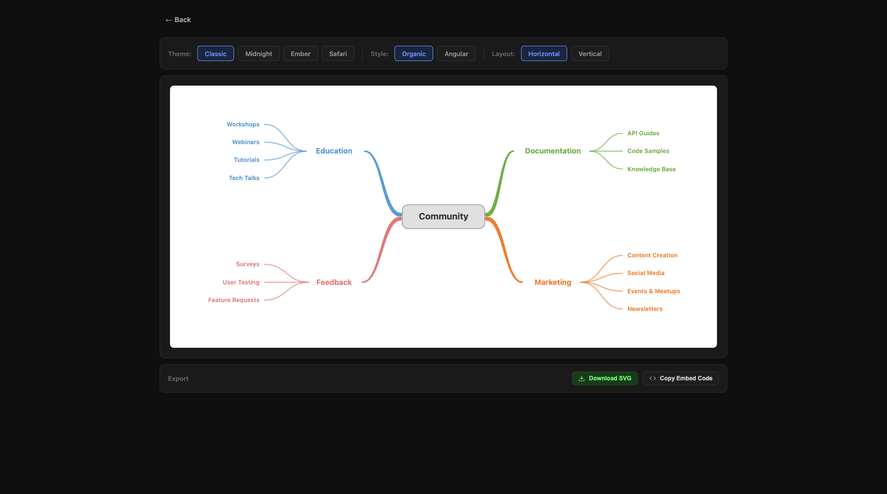
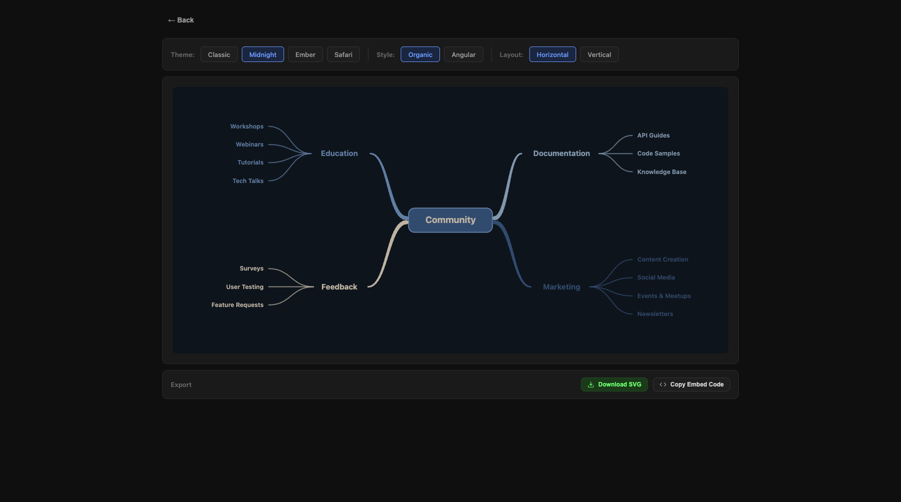
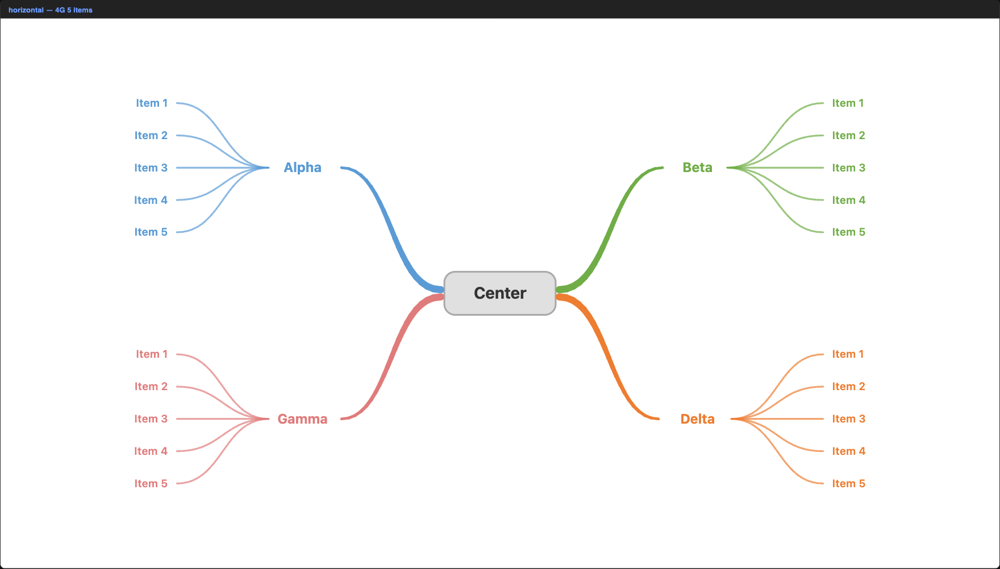
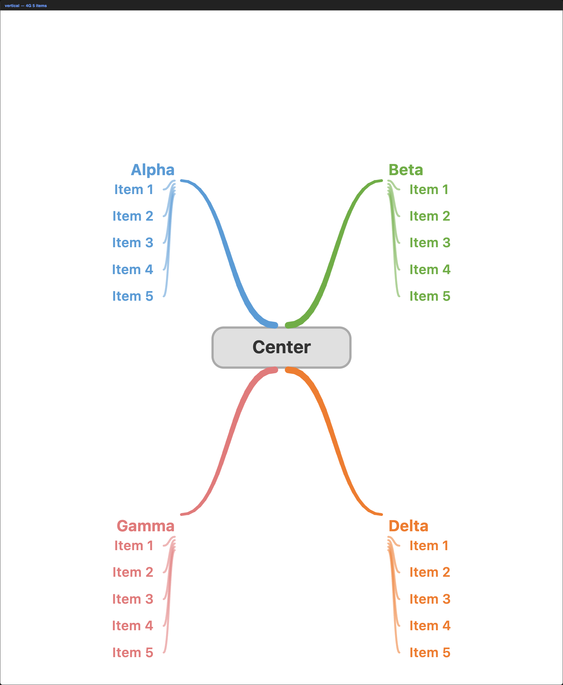

# Mindmap Studio

A browser-based mindmap builder and viewer. Create mindmaps visually, customize with themes/styles/layouts, and export as SVG or embeddable HTML — all in a single `index.html` file with zero dependencies.



## Features

- **Visual Builder** -- create mindmaps with a form-based UI (center word, up to 4 groups, unlimited items per group)
- **Live Viewer** -- instantly preview your mindmap with real-time theme/style/layout switching
- **4 Color Themes** -- Classic, Midnight, Ember, Safari
- **2 Line Styles** -- Organic (smooth bezier curves) and Angular (90-degree lines)
- **2 Layouts** -- Horizontal (landscape) and Vertical (portrait)
- **Templates** -- 3 built-in templates (Community, Startup, Web Dev) to start from or customize
- **Local Storage** -- your mindmaps are saved in the browser and persist across sessions
- **Export SVG** -- download any mindmap as a scalable vector graphic
- **Copy Embed Code** -- one-click copy of a self-contained HTML snippet you can paste into any webpage (zero dependencies)
- **Tapered Branches** -- lines taper from thick to thin for a polished, hand-drawn feel
- **Adaptive Sizing** -- canvas auto-scales based on content length and group count
- **Feature Flags** -- toggle experimental features via a settings page
- **Python Generator** -- `mm.py` for batch-generating SVG/PNG files programmatically

## Screenshots

### Home Page

Browse templates, view saved mindmaps, or create a new one.


### Builder

Form-based editor with center word, groups, and items. Save or build instantly.



### Viewer -- Classic Theme (Horizontal)

Switch themes, styles, and layouts in real time. Export from the bottom bar.



### Viewer -- Midnight Theme (Horizontal)



### Horizontal Layout



### Vertical Layout



## Quick Start

No build step required. Just open the file in a browser:

```bash
# Option 1: local server (recommended)
python -m http.server 8765
# Open http://localhost:8765

# Option 2: open directly
open index.html
```

## How It Works

1. **Home** -- pick a template or click "+ New Mindmap"
2. **Builder** -- enter a center word, add up to 4 groups with items, then click "Build Mindmap"
3. **Viewer** -- switch between themes (Classic / Midnight / Ember / Safari), styles (Organic / Angular), and layouts (Horizontal / Vertical)
4. **Export** -- download the SVG file or copy an embeddable HTML snippet to your clipboard

## Themes

| Theme | Background | Style |
|-------|-----------|-------|
| **Classic** | White | Colorful branches on white |
| **Midnight** | Dark navy | Muted blues and grays |
| **Ember** | Deep red | Warm golds and reds |
| **Safari** | Earthy brown | Greens, golds, and oranges |

## Export Options

### Download SVG
Click "Download SVG" to save the mindmap as a vector file. The filename includes the theme, style, and layout (e.g., `community_classic_organic_horizontal.svg`).

### Copy Embed Code
Click "Copy Embed Code" to copy a self-contained HTML snippet to your clipboard. Paste it into any webpage -- no JavaScript or external dependencies required. The SVG scales responsively to fit its container.

## Python Generator

For batch generation or CI/CD integration, use the Python script:

```bash
pip install matplotlib
python mm.py
```

This generates all combinations of theme/style/layout as SVG and PNG files.

```python
from mm import draw_mindmap, MINDMAP

# Default: classic theme, organic style, horizontal layout
draw_mindmap(MINDMAP, "output.svg")

# Customize
draw_mindmap(MINDMAP, "dark.svg", theme="midnight", style="angular", layout="vertical")
```

### Parameters

| Parameter | Options | Default |
|-----------|---------|---------|
| `theme` | `classic`, `midnight`, `ember`, `safari` | `classic` |
| `style` | `organic`, `angular` | `organic` |
| `layout` | `horizontal`, `vertical` | `horizontal` |

## Project Structure

```
mindmap/
  index.html    -- Single-file React app (viewer + builder + renderer)
  mm.py         -- Python SVG/PNG generator
  screenshots/  -- README screenshots
```

## Requirements

- Any modern browser (Chrome, Firefox, Safari, Edge)
- Python 3.7+ and matplotlib (only for the Python generator)
